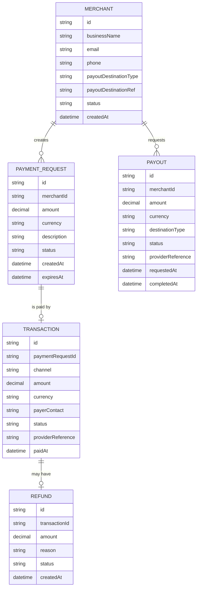

# Domain Model

The platform tracks merchants, the payment requests they raise, the transactions
payers complete against them, and the payouts merchants draw from their balance.

- **Merchant** — a registered business; `status` tracks active/suspended.
`payoutDestinationType` is `bank` or `mobile-wallet`.
- **PaymentRequest** — an amount a merchant asks a payer to pay; `status`
moves from `pending` to `paid` or `expired`.
- **Transaction** — the payer's actual payment against a request, via
`channel` `mobile-money` or `card`; `status` is `pending`, `succeeded` or
`failed`.
- **Refund** — a merchant-initiated reversal of a succeeded transaction.
- **Payout** — an on-demand withdrawal of a merchant's balance to their payout
destination; `status` moves from `pending` to `completed` or `failed`.

