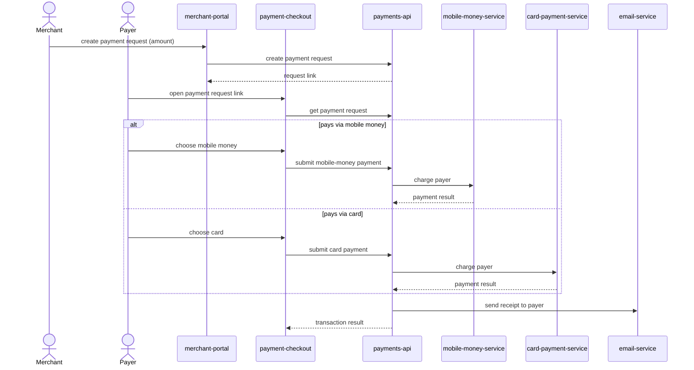

# Merchant Payment Collection

A Merchant raises a payment request and a Payer pays it via mobile money or
card, receiving a receipt by email.

```mermaid
sequenceDiagram
    actor Merchant
    actor Payer
    participant portal as merchant-portal
    participant checkout as payment-checkout
    participant api as payments-api
    participant mobilemoney as mobile-money-service
    participant card as card-payment-service
    participant email as email-service

    Merchant->>portal: create payment request (amount)
    portal->>api: create payment request
    api-->>portal: request link

    Payer->>checkout: open payment request link
    checkout->>api: get payment request
    alt pays via mobile money
        Payer->>checkout: choose mobile money
        checkout->>api: submit mobile-money payment
        api->>mobilemoney: charge payer
        mobilemoney-->>api: payment result
    else pays via card
        Payer->>checkout: choose card
        checkout->>api: submit card payment
        api->>card: charge payer
        card-->>api: payment result
    end
    api->>email: send receipt to payer
    api-->>checkout: transaction result
```

