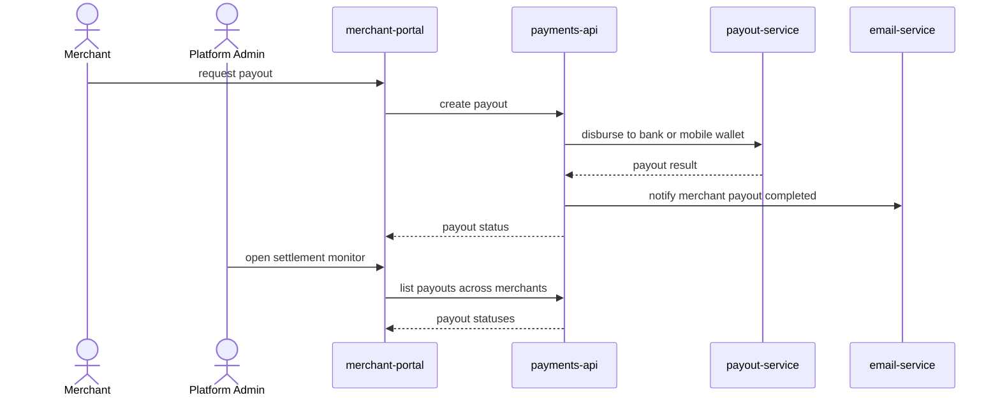

# Merchant Payout Settlement

A Merchant requests an on-demand payout of their collected balance, and is
notified by email once it completes. A Platform Admin monitors payout runs
across all merchants.

